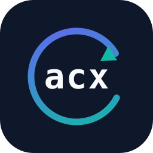

<p align="center">
  
</p>

<h1 align="center">shuhari</h1>

<p align="center"><b>shu — state management for agent skills</b></p>

<p align="center">
  <a href="LICENSE"></a>
  
  <a href=".github/workflows/ci.yml"></a>
</p>

## What is this?

You write **skills** — instruction files that teach AI agents (Claude Code,
Codex, Cursor…) how to do things your way. They're good, so they get copied
into other projects and shared with teammates. And from that moment, every
copy lives its own life: one person fixes something and nobody else gets the
fix, another copy quietly goes stale, and soon there are six versions of "the"
skill and no one knows which is right.

`shu` fixes that. You keep your skills in one ordinary git repo — **the
library** — and shu manages every copy pulled from it:

- **See where you stand** — `shu status` tells each project whether its copies
  are current, behind, or locally customized.
- **Update without losing your tweaks** — `shu update` pulls in the library's
  improvements and merges them *around* your local edits. When both changed
  the same line, it stops and shows you both versions instead of guessing.
- **Send improvements home** — `shu harvest` turns a local fix into a normal
  pull request on the library, credited to you, for the maintainer to review.
  Lessons stop dying in one project's folder.
- **One skill, every tool** — a single source copy is auto-formatted for
  Claude Code, Codex, Cursor, and `AGENTS.md`/`CLAUDE.md`.

No server, no accounts, no new place to put your files — just a small binary
plus the git repos you already have. New to all this? Read
**[docs/CONCEPTS.md](docs/CONCEPTS.md)** — the plain-English tour — or run the
five-minute sandbox demo: `bash docs/demo.sh`.

## Why "shuhari"?

**Shu-Ha-Ri** (守破離) is the martial-arts description of how a form is
mastered: **shu** — follow the canonical form exactly; **ha** — adapt it to
your own circumstances; **ri** — transcend it and give new form back to the
school. That is precisely this tool's loop: stay `aligned` with the library
(*shu*), customize your copy locally (*ha*, what we call `drifted`), and
`harvest` your improvements back into the canon (*ri*). The binary is `shu` —
where every practitioner starts.

## The design in 90 seconds (for engineers)

shu treats one canonical skills repo as *upstream* and manages the loop
between it and a fleet of consuming repos. It is not a registry and not a
marketplace. The mechanism: installs are vendored alongside a lockfile
(`skills.lock`) **and a committed snapshot of exactly what was received** —
the ancestor that makes drift computable offline and gives `update` a true
3-way merge base, so local customization survives every sync. On top of that
engine: version constraints and content-hash pins, eval-gated fleet
propagation (Renovate-style update PRs that must pass each skill's promptfoo
suite), harvest/reconcile for the contribution-back direction, and a
governance layer (verify, scan, audit). Everything ships in the repos as
plain files; every mutation is a git commit or a PR. Full design rationale:
[PLAN.md](PLAN.md) (the original strategy document — reads like one).

**Status: v0.1.0 — the complete planned CLI surface, working.** What remains
is the hosted control plane (approval workflows, signing, dashboards);
everything a single binary can do is here.

## Install

```sh
go install github.com/navisoft0/shuhari/cmd/shu@latest
```

While this repo is private, tell Go to fetch it over authenticated git first:
`export GOPRIVATE=github.com/navisoft0`. Or build from a clone — the result is
a single self-contained binary you can hand to teammates directly:

```sh
go build -o shu ./cmd/shu    # Go 1.24+, no other dependencies
```

## Quickstart

In the canonical skills repo (one folder per skill, spec-compliant `SKILL.md`):

```sh
shu init          # scaffolds skills/example-skill/{SKILL.md,evals/}
```

In a consuming repo:

```sh
shu add deploy-checklist@^1.4 --from git@github.com:your-org/skills.git \
        --surfaces claude-code,codex,agents-md
# added deploy-checklist@1.4.0 -> .claude/skills/deploy-checklist (sha256:...)
# projected -> .codex/skills/deploy-checklist
# projected -> AGENTS.md
# (@^1.4 floats within the major; @1.4.0 pins the version; --pin pins the
#  exact content hash for security-sensitive fleets)

shu status
# SKILL             STATE    VERSION  PATH
# deploy-checklist  aligned  1.4.0    .claude/skills/deploy-checklist

shu diff deploy-checklist            # local edits vs recorded ancestor
shu diff deploy-checklist --latest   # incoming upstream changes vs ancestor

shu update
# deploy-checklist: fast-forwarded 1.4.0 -> 1.5.0        (no local edits)
# deploy-checklist: merged 1.5.0 cleanly, local edits preserved
# deploy-checklist: merged 1.5.0, conflicts in: SKILL.md — resolve the <<<<<<< markers…

shu verify                           # CI gate: working tree + snapshots match skills.lock
shu project                          # re-render surfaces after hand edits or resolution

shu eval deploy-checklist            # run the skill's suite (promptfoo-compatible)
shu eval deploy-checklist --scaffold # generate a starter suite for a skill without one

shu harvest deploy-checklist --push  # local drift -> attributed branch on the upstream
# open a PR: https://github.com/your-org/skills/compare/shu/harvest/deploy-checklist?expand=1
```

In the canonical repo, to fan updates out (locally or from CI — see
`docs/github-action-example.yml`):

```sh
echo '{"repos": ["git@github.com:org/app-a.git", "git@github.com:org/app-b.git"]}' > fleet.json
shu propagate --push
# === git@github.com:org/app-a.git ===
# deploy-checklist: fast-forwarded 1.4.0 -> 1.5.0
# eval deploy-checklist: 12 passed, 0 failed
# pushed shu/skills-update
# open a PR: https://github.com/org/app-a/compare/shu/skills-update?expand=1
```

`propagate` clones each fleet repo, runs the same merge engine `update` uses,
then gates on evals: a repo whose suite fails (or whose merge conflicts) is
reported and skipped, its working clone kept for inspection — nothing ships
that regresses the suite, and nothing merges without review. `harvest` is the
loop's other direction: edge learnings travel upstream as ordinary PRs with
the consuming repo, ancestor version, and author recorded in the commit.

Maintainer and governance tooling in the canonical repo:

```sh
shu status --fleet        # drift heat-map data: every repo x skill, --json for dashboards
shu reconcile             # cluster shu/harvest/* branches; flag overlapping learnings
                          #   (block-level: edits within ±2 lines of the same base region)
shu scan                  # prompt-injection / payload heuristics + $SHU_SCAN_CMD hook;
                          #   also runs automatically as a warning on add/update
shu audit deploy-checklist  # content-level change log: who changed what prose, when
shu update --ai-merge     # conflicts get an AI-proposed resolution in <file>.proposal
                          #   via $SHU_AI_MERGE_CMD — proposed, never auto-applied
```

Commit `skills.lock` and `.shuhari/ancestors/` — they are the state that
makes drift computable on any checkout, offline, and the ancestor snapshots
are the merge base `shu update` uses to preserve local customization.

## Updates never clobber

`update` decides per skill from its drift state: `behind` fast-forwards,
`drifted` is left alone (those are your local learnings — send them upstream
with `harvest` when ready), and `diverged` gets a file-level 3-way merge (ancestor
as base) that combines non-overlapping changes and writes git-style conflict
markers when they overlap, exiting 1 so nothing ships unresolved. Add/delete
conflicts always keep the side with local edits. After an update the ancestor
advances to the new upstream content, so whatever you keep locally reads as
customization of the new base.

## Surfaces (adapter pattern)

One canonical working copy per skill (the primary, `.claude/skills/`),
projected into each configured surface. Projections are generated artifacts —
re-rendered by `add`, `update`, and `project`, never edited in place:

| Surface | Renders to |
|---|---|
| `claude-code` | `.claude/skills/<name>/` (the working copy itself) |
| `codex` | `.codex/skills/<name>/` (full mirror) |
| `cursor` | `.cursor/rules/<name>.mdc` (body as a project rule) |
| `agents-md` | managed `<!-- shuhari:skill:… -->` section in `AGENTS.md` |
| `claude-md` | managed section in `CLAUDE.md` |

## Drift states

`shu status` compares three content hashes per skill — working copy, recorded
ancestor (what you last synced), and upstream latest:

| State | Meaning |
|---|---|
| `aligned` | working == ancestor == latest — nothing to do |
| `behind` | upstream moved, local untouched — clean fast-forward |
| `drifted` | local edits, upstream unmoved — learnings to harvest |
| `diverged` | both moved — 3-way merge required |
| `missing` | in the lockfile but not on disk |

`status` exits non-zero when anything is not aligned, and `--json` emits
machine-readable rows, so the same binary gates CI. `--offline` skips the
upstream refresh and compares against last-synced content only.

## Layout

```
cmd/shu/            entry point
internal/cli/       command implementations (init, add, status, diff, update, verify,
                    project, eval, harvest, propagate, reconcile, scan, audit)
internal/lockfile/  skills.lock + ancestor snapshot locations
internal/drift/     the five-state drift resolver
internal/merge/     file-level 3-way merge (ancestor as base, conflict markers on overlap)
internal/adapters/  surface adapters: codex, cursor, agents-md, claude-md
internal/evals/     promptfoo-compatible runner integration + suite scaffolding
internal/scan/      supply-chain heuristics (prompt injection, exec payloads)
internal/semver/    constraint arithmetic (exact, caret, content pins)
internal/hashdir/   deterministic directory content hashing
internal/upstream/  source resolution (local path or cached git clone)
internal/skillmeta/ SKILL.md frontmatter parsing
```

## Roadmap

The CLI surface from [PLAN.md](PLAN.md) §5 is fully implemented and tagged
v0.1.0. Known thin spots headed for v0.2: rollback/install of historical
versions from the library, marking drift as intentional, a `list` command for
browsing a library, block-level markdown merge, configurable library layouts,
and prebuilt release binaries (brew / curl installer). Beyond that sits the
phase-2 control plane: hosted approval workflows, signing/provenance, and org
dashboards over `status --fleet --json`.

## License

[MIT](LICENSE). Contributions welcome — see [CONTRIBUTING.md](CONTRIBUTING.md).
